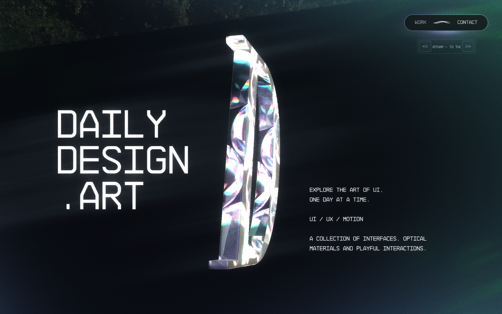
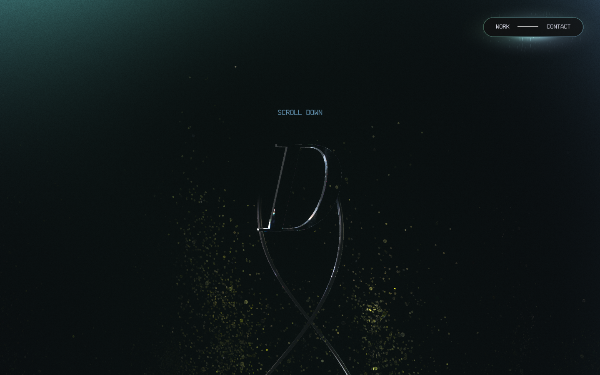
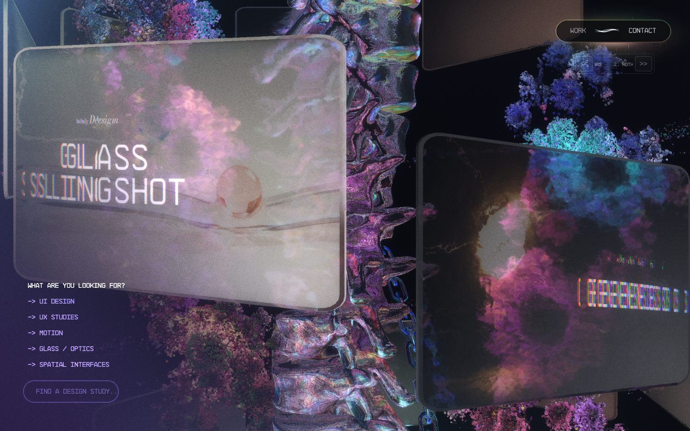
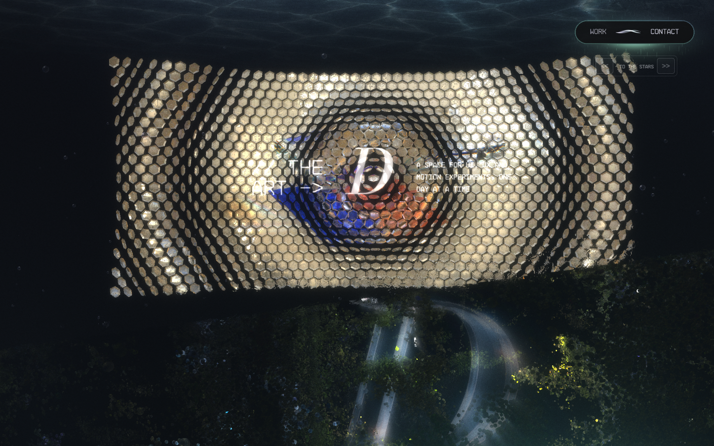
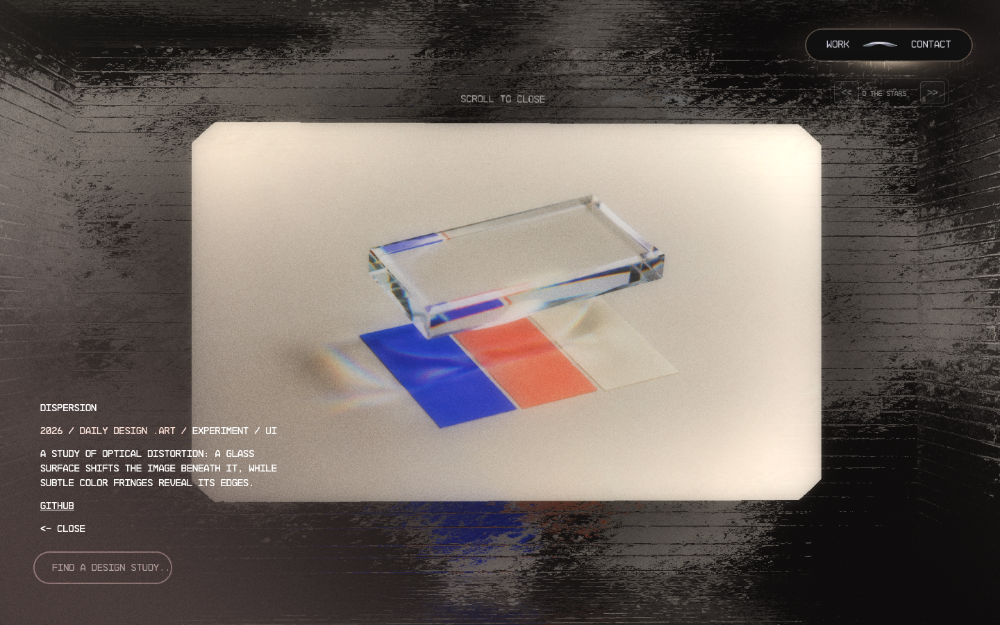
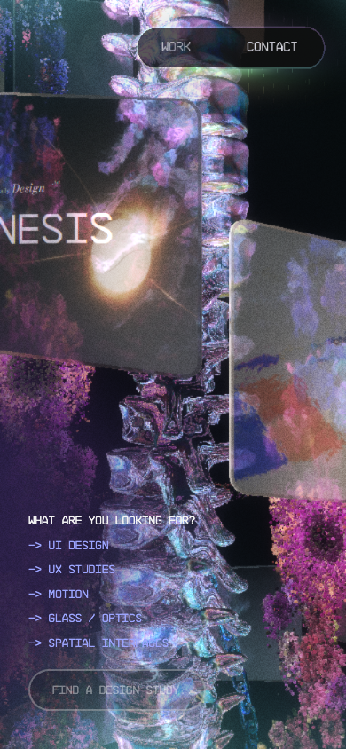
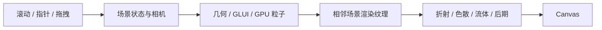

<div align="center">

<h1>Open Active Theory</h1>

<p><strong>Daily Design .Art · WebGL 互动叙事与光学设计实验</strong></p>
<p>Explore the art of UI, one day at a time.</p>

<p>
  <a href="https://github.com/Snychng/open-active-theory/actions/workflows/check.yml"></a>
  
  
</p>

<p>
  <a href="#快速开始">快速开始</a> ·
  <a href="#预览">预览</a> ·
  <a href="#技术实现">技术实现</a> ·
  <a href="#自定义内容">自定义内容</a> ·
  <a href="#开发与验证">开发与验证</a>
</p>

</div>



Open Active Theory 是一个可以独立克隆、构建和运行的 **Daily Design .Art 品牌网站**。项目基于 [Active Theory](https://activetheory.net/) 的公开 Hydra/WebGL 发布版，将品牌、模型、作品和媒体替换为自有 UI/UX 设计研究，同时保留原场景、镜头、粒子、流体、玻璃折射及交互机制。

源码、构建基线和运行资源均包含在仓库内。项目无需 API 密钥、在线 CMS 账户、相邻工作区或系统字体。

## 项目特点

- **六段连续场景**：Home、About、Work、TreeScene、CleanRoom、Footer，通过滚动驱动镜头和相邻场景转场。
- **实时光学材质**：折射、色散、流体扰动、粒子、Bloom 与光芒共同构成 WebGL 画面。
- **完整作品交互**：14 项 UI/UX 研究，支持作品墙、标签筛选、本地检索、详情展开、全屏图片与深链接。
- **自有品牌几何**：由斜体 D 的字体轮廓构建真实三维模型，适配不同场景的尺寸与材质。
- **可维护的内容适配层**：品牌与作品集中配置，构建时检查核心视觉模块、场景参数和 GLSL 基线。
- **桌面与移动布局**：保留原响应式分支、触摸交互、音乐控件和双端房间同步协议。

## 快速开始

### 环境要求

- **Node.js 20 或更新版本**；建议使用 Node.js 22，与 CI 环境一致。
- **npm**，用于按 `package-lock.json` 安装依赖。
- 支持 WebGL 的浏览器；实际画面与性能受硬件加速、GPU 档位及视口影响。

### 克隆并运行

```bash
git clone https://github.com/Snychng/open-active-theory.git
cd open-active-theory
npm ci
npm run build
npm run dev
```

启动后访问 **[http://localhost:4199/](http://localhost:4199/)**。在运行服务的终端按 `Ctrl+C` 停止。

macOS / Linux 下可指定其他端口：

```bash
PORT=4200 npm run dev
```

`npm run dev` 与 `npm start` 都启动 Node.js 服务。修改内容或构建脚本后，运行 `npm run build` 并刷新网页；当前开发服务不提供热更新。

服务同时承载静态资源、深链接、本地检索和 WebSocket。完整运行请使用上述 Node.js 入口；单独托管 `public/` 只能提供静态资源，不能提供检索与同步服务。

## 预览

以下均为当前网站的实际运行截图，采集于 2026-10-03。桌面视口为 **1440 × 900**，移动端为 **390 × 844** 的浏览器模拟；静态截图展示场景外观，完整动画与交互请在本地体验。

| 首屏 · D 模型与粒子 | 作品墙 · 螺旋布局与折射卡片 |
| --- | --- |
|  |  |

| 光学实验 · 六边形空间 | 作品详情 · 静态封面与内容 |
| --- | --- |
|  |  |

<details>
<summary><strong>查看移动端作品墙</strong></summary>

<p></p>

</details>

截图来源、采集条件和更新方式见 [展示资源说明](docs/images/README.md)。

## 技术实现

### 技术栈

| 层级 | 技术 | 职责 |
| --- | --- | --- |
| 网页运行时 | JavaScript、Hydra、GLUI | 场景生命周期、状态、相机、渲染调度、文字与交互 |
| 实时渲染 | WebGL、GLSL | 光学材质、GPU 粒子、流体、离屏纹理和后期合成 |
| 内容与配置 | ES Modules、UIL、JSON | 品牌、作品、场景配置及资源映射 |
| 素材构建 | Three.js、opentype、Sharp | D 模型、字体轮廓、字标贴图与图标生成 |
| 本地服务 | Node.js HTTP、ws | 资源读取、Range、深链接、作品查询与房间同步 |
| 工程验证 | Playwright、Node.js assert、GitHub Actions | 资源与参数核验、桌面/移动端交互和 CI |

**Three.js 用于构建品牌几何；浏览器的场景渲染仍由 Hydra 完成。** opentype 使用 Three.js 附带的模块，具体依赖版本锁定在 `package-lock.json`。

### 1. 场景与渲染链路



`FXScroll` 将滚动位置映射为场景进度、镜头位置和转场状态。相邻场景使用渲染纹理参与合成，保留原站的斜切、遮挡和光学过渡。页面沿用以下配置顺序：

| 场景 | 原 `vh` 配置 | 内容与视觉 |
| --- | --- | --- |
| Home | 4 | 可拖拽的 D、粒子与双螺旋 |
| About | 1 | 品牌文字、slogan 与折射 D |
| Work | 10 | 14 项研究、螺旋作品墙与详情 |
| TreeScene | 2 | 品牌模型与粒子场景 |
| CleanRoom | 1.2 | 六边形光学空间与实验内容 |
| Footer | 4 | 尾段场景与品牌收束 |

`vh` 为原引擎的场景配置值，实际高度与可见区间由滚动控制器和响应式布局计算。核心实现可从 [FXScroll](vendor/activetheory/modules/122-FXScroll.js) 与 [原发布配置](vendor/activetheory/uil.1780406240914.json) 开始阅读。

### 2. 玻璃、粒子与指针流体

玻璃材质通过 GLSL 对场景纹理进行采样，结合折射、色散、法线和指针扰动生成光学变化。GLUI 与字体图集承载大量场景文字，检索输入和部分控件由 DOM 承载。

[Fluid](vendor/activetheory/modules/117-Fluid.js) 使用速度、染料、压力等离屏缓冲，执行旋度、涡量、散度、压力求解和平流计算。[MouseFluid](vendor/activetheory/modules/179-MouseFluid.js) 将指针位移和速度注入流场，供材质采样。粒子规模、DPR、帧率和后期效果由原 GPU 档位分支选择，因此不同设备的帧率和画面细节会有差别。

光学 Shader、环境纹理及非内容材质参数沿用原发布版基线；构建与检查分别核对原 GLSL 指纹和非内容配置字段。

### 3. 内容适配与构建

[scripts/build.mjs](scripts/build.mjs) 从保存的发布版基线构建品牌网站：

1. 读取 `src/content.mjs`、字体、轮廓、字标和封面。
2. 在指定模块和 UIL 字段中替换品牌、作品、链接与媒体，找不到适配位置时直接报错。
3. 生成 HTML、CMS JSON、图标、贴图和三维几何，写入 `public/`。
4. 核对 **15 个核心视觉模块**、原场景顺序及 GLSL，并记录允许替换的内容字段。

检查脚本逐字段比较配置：当前 **2578 项非内容 UIL 字段**保持原值，品牌、文字、模型与媒体字段单独记录。构建记录保存在 `.artifacts/adaptation-manifest.json`，方便追踪适配位置和资源指纹。

### 4. 品牌 D 模型

三维 D 来自 `src/assets/monogram-shape.json` 中的轮廓与孔洞。构建使用 Three.js 的 `Shape`、`Path` 和 `ExtrudeGeometry` 完成挤出、倒角、居中与法线计算，再分别生成 Home、TreeScene 和粒子场景需要的几何。

模型适配原几何的尺寸、深度与中心约定，外部位置、旋转、镜头、材质和交互继续沿用原配置。Bodoni Moda 字体用于 D 图像，预先保存的字标 SVG 消除了系统字体依赖。

### 5. 静态封面与作品交互

作品媒体使用 JPEG 封面，沿用原 `VideoTexture` 的纹理接口，并补全图片的动态 `src` 和可见性生命周期。每项作品具有独立媒体 URL，封面复用时也能按当前卡片激活淡入。

作品墙保留相机路径、悬停和筛选流程；详情沿用展开、退出、文字及粒子动画，全屏媒体显示当前作品图片。生成物包含 14 项自有实验或明确标注的概念研究。

### 6. HTTP、检索与双端同步

[scripts/server.mjs](scripts/server.mjs) 提供项目的运行服务：

- 静态文件、正确的资源 MIME 类型与 HTTP Range。
- `/work/dispersion` 等深链接的页面回退。
- `/api/assistant/*` 的本地查询协议：按作品名称、标签和描述做关键词匹配，支持部分中文关键词映射。
- `/ws` 的房间协议：创建/加入房间、成员状态、消息广播及交互数据同步。
- `/__health` 的服务与资源缺失统计。

检索线程与同步房间保存在进程内存中，服务重启后重置。这里提供的是本地关键词检索与房间服务，原站私有 AI 和远端后台未包含在仓库内。

## 项目结构

```text
open-active-theory/
├── src/
│   ├── content.mjs              # 品牌、slogan、链接与 14 项研究
│   └── assets/                  # 字体、轮廓、字标与封面输入
├── vendor/activetheory/          # 发布版基线、模块、UIL 与来源记录
├── public/                      # 网站生成物和必要运行资源
├── scripts/
│   ├── build.mjs                # 内容适配、几何与贴图构建
│   ├── server.mjs               # HTTP、检索和 WebSocket
│   ├── check.mjs                # 模块、参数、资源与服务检查
│   ├── verify*.mjs              # 浏览器、同步、音乐与媒体检查
│   └── test.mjs                 # 构建、临时服务与完整检查入口
├── docs/images/                 # README 精选运行截图
├── .github/workflows/check.yml  # GitHub Actions
├── AGENTS.md                    # 项目维护约定
└── THIRD_PARTY_NOTICES.md        # 第三方来源与许可说明
```

`node_modules/` 和 `.artifacts/` 不提交 Git。原工作区的其他原型、研究录屏、社交封面和平台请求记录也不包含在此仓库中。

## 自定义内容

| 需要修改的内容 | 编辑入口 |
| --- | --- |
| 品牌、slogan、GitHub、作品名称/描述/标签 | [src/content.mjs](src/content.mjs) |
| 封面与背景图片 | [src/assets/covers/](src/assets/covers/) 及作品配置中的媒体映射 |
| D 轮廓、字标、字体 | [src/assets/](src/assets/) |
| 内容适配与几何生成规则 | [scripts/build.mjs](scripts/build.mjs) |
| 服务端查询和同步协议 | [scripts/server.mjs](scripts/server.mjs) |

修改输入后执行：

```bash
npm run build
```

品牌与作品修改集中在 `src/` 和构建适配层；`public/` 保存生成物，下一次构建会重新写入对应文件。涉及内容以外的镜头、材质或动效修改时，需要对照基线并同步相关验证，避免把品牌适配变成隐含的动画重写。

## 开发与验证

### 完整检查

```bash
npx playwright install chromium
npm test
```

`npm test` 自动构建、启动随机端口、执行资源/服务检查，以及桌面和模拟手机的六场景、拖拽、详情、联系、筛选、检索和四处卡片媒体激活检查，结束后关闭测试服务器。

本机已有 Google Chrome 时可以使用：

```bash
PLAYWRIGHT_CHANNEL=chrome npm test
```

### 专项检查

先运行 `npm run build` 和 `npm run dev`，再在另一个终端执行：

| 命令 | 检查内容 |
| --- | --- |
| `npm run check` | 核心模块、UIL、GLSL 回读、资源、深链接、Range 与检索 |
| `npm run verify` | 桌面/移动端场景、转场、拖拽、详情、筛选与检索 |
| `npm run verify:media` | 四处 Work 位置的当前卡片媒体激活 |
| `npm run verify:sync` | 两个浏览器上下文的入房、滚动与联系面板同步 |
| `npm run verify:music` | 音乐初始化、开关、切歌与播放状态 |

上述浏览器命令需要 Playwright Chromium，或设置 `PLAYWRIGHT_CHANNEL=chrome`。非默认端口可使用 `PREVIEW_URL`：

```bash
PREVIEW_URL=http://localhost:4200 npm run verify
```

### CI 与报告

[GitHub Actions](https://github.com/Snychng/open-active-theory/actions/workflows/check.yml) 在 Ubuntu、Node.js 22 和 Playwright Chromium 上运行完整检查。CI 使用 Xvfb 与 Mesa 软件 OpenGL 提供 WebGL 上下文，保留原站对 SwiftShader 的设备检测。异步筛选和媒体淡入以实际完成状态等待，失败时上传诊断 JSON。

报告与运行截图位于 `.artifacts/`。完整检查包含浏览器和媒体检查；同步与音乐为单独的专项命令。工程检查、静态截图、真实手机操作和用户视觉验收分别记录，不能互相替代。

## 已知边界

- 原站的私有 AI、后台和云端同步服务未包含在仓库内；本地查询与房间协议有明确的替代范围。
- 发布版基线中的 `lab.gif` 和 `damaged_road_normal.jpg` 缺失，继续由原渲染器回退；相关检查保留这两个已知缺失项。
- 随机粒子、GPU 档位、帧率、字体内容和自有模型轮廓会产生画面差异。模块与参数保持一致不等于每一帧像素一致。
- 浏览器模拟的移动布局检查不代表真实手机验收；自动化音乐状态检查不代表扬声器输出已实测。

## 贡献

欢迎通过 [Issues](https://github.com/Snychng/open-active-theory/issues) 提交问题或改进建议。报告视觉/交互问题时，请提供浏览器、GPU、视口、复现步骤与相关截图；提交代码修改时说明行为变化并运行受影响的检查。

维护约定见 [AGENTS.md](AGENTS.md)，已有实现取舍见 [.agents/notes](.agents/notes/README.md)。新增素材需记录来源，敏感信息、账户文件和完整测试产物不进入仓库。

## 来源与许可

本项目基于 Active Theory 公开发布版 **`1780406240914`**，快照时间为 **2026-09-30**。运行时、Shader、场景参数、部分模型、纹理、字体图集和音乐保留各自来源与版权声明；本仓库没有为整个发布包附加统一 MIT 许可。

- 来源与依赖说明：[THIRD_PARTY_NOTICES.md](THIRD_PARTY_NOTICES.md)。
- 发布版来源、指纹与凭证移除记录：[vendor/activetheory/SOURCE.json](vendor/activetheory/SOURCE.json)。
- Bodoni Moda 字体许可：[SIL Open Font License](src/assets/OFL.txt)。

Daily Design .Art 品牌内容、D 几何、字标和封面适配由本项目提供。作品属于自有实验或概念研究。
